# Smart Home Kubernetes Deployment Architecture

## Architecture Diagram

```mermaid
graph TB
    subgraph "External Access"
        Internet((Internet))
        Domain[squirrelnet.co.uk]
        Internet --> Domain
    end

    subgraph "Load Balancer Layer"
        MetalLB[MetalLB LoadBalancer<br/>192.168.1.201-210]
        Domain --> MetalLB
    end

    subgraph "Ingress Layer"
        NginxIngress[NGINX Ingress Controller]
        MetalLB --> NginxIngress
    end

    subgraph "Application Layer"
        subgraph "Data & Analytics Namespace"
            Grafana[Grafana Dashboard<br/>Port 3000]
            Airflow[Apache Airflow<br/>Scheduler + Webserver<br/>Port 8080]
            Kapacitor[Kapacitor<br/>Stream Processing]
        end

        subgraph "Market Insights Namespace"
            MarketAPI[MarketInsights API]
            ModelServer[Model Server<br/>gRPC + HTTP]
            PortfolioMgr[Portfolio Manager]
            PriceStore[Price Store]
        end

        subgraph "IoT & Home Automation"
            SmartHomeActions[Smart Home Actions]
            SmartHomeCollector[Smart Home Collector]
            ArloIntegration[Arlo Security Integration]
            TuyaIntegration[Tuya Device Integration]
            LGTVControl[LG TV Control]
            GoogleFit[Google Fit Integration]
        end

        subgraph "Media & Streaming"
            Stremio[Stremio Media Server]
            RTL_SDR[RTL-SDR Radio]
            ChromecastMQTT[MQTT Chromecast Server]
        end

        subgraph "Infrastructure Services"
            MQTT[Mosquitto MQTT Broker<br/>Port 1883]
            SealedSecrets[Sealed Secrets Controller]
            Tailscale[Tailscale VPN]
        end
    end

    subgraph "Storage Layer"
        subgraph "Time Series Storage"
            InfluxDB[InfluxDB<br/>Port 8086/8088<br/>ARM64]
        end

        subgraph "Relational Storage"
            PostgreSQL[PostgreSQL Database]
        end

        subgraph "Cache & Message Queue"
            Redis[Redis<br/>Port 6379]
        end

        subgraph "File Storage"
            NFS[NFS Storage Provider]
        end
    end

    subgraph "Monitoring & Metrics"
        MetricsCollector[Telegraf Metrics Collector<br/>AMD64 + ARM nodes]
        LogDNA[LogDNA Log Aggregation]
    end

    subgraph "Node Architecture"
        subgraph "ARM64 Nodes"
            ARM_Node1[ARM64 Node<br/>InfluxDB, Airflow]
        end
        subgraph "AMD64 Nodes"  
            AMD_Node1[AMD64 Node<br/>Other Services]
        end
    end

    %% Application Connections
    NginxIngress --> Grafana
    NginxIngress --> Airflow
    NginxIngress --> MarketAPI
    NginxIngress --> Stremio

    %% Data Flow Connections
    Grafana --> InfluxDB
    Kapacitor --> InfluxDB
    Airflow --> PostgreSQL
    Airflow --> Redis
    MetricsCollector --> InfluxDB
    SmartHomeCollector --> InfluxDB
    ArloIntegration --> MQTT
    TuyaIntegration --> MQTT
    ChromecastMQTT --> MQTT

    %% Market Data Flow
    MarketAPI --> ModelServer
    MarketAPI --> PriceStore
    ModelServer --> PortfolioMgr

    %% Storage Connections
    Grafana -.-> NFS
    Airflow -.-> NFS
    InfluxDB -.-> NFS

    %% Security
    SealedSecrets -.-> Grafana
    SealedSecrets -.-> Airflow
    SealedSecrets -.-> MarketAPI

    %% Load Balancer IPs
    MetalLB -.-> MQTT

    classDef storage fill:#e1f5fe
    classDef app fill:#f3e5f5
    classDef infrastructure fill:#fff3e0
    classDef monitoring fill:#e8f5e8
    classDef external fill:#ffebee

    class InfluxDB,PostgreSQL,Redis,NFS storage
    class Grafana,Airflow,MarketAPI,Stremio app
    class MetalLB,NginxIngress,SealedSecrets,Tailscale infrastructure
    class MetricsCollector,LogDNA monitoring
    class Internet,Domain external
```

## Architecture Summary

### Infrastructure Layers
1. **External Access**: Domain routing through squirrelnet.co.uk
2. **Load Balancing**: MetalLB providing IPs 192.168.1.201-210  
3. **Ingress**: NGINX handling SSL termination and path routing
4. **Applications**: Multi-namespace deployment across different domains

### Key Components
- **Data Pipeline**: Airflow orchestrates ETL jobs with CeleryKubernetesExecutor
- **Monitoring Stack**: Grafana + InfluxDB + Kapacitor for time-series visualization
- **IoT Hub**: MQTT broker connecting various smart home devices
- **Market Analytics**: Dedicated namespace for financial data processing
- **Storage**: Multi-tier with InfluxDB (time-series), PostgreSQL (relational), Redis (cache)

### Node Architecture
- ARM64 nodes for specific workloads (InfluxDB, Airflow)
- Mixed architecture deployment with node selectors
- Persistent storage via NFS provisioner

### Namespaces Identified
- `storage`: InfluxDB, PostgreSQL, Redis
- `grafana`: Grafana dashboard and configuration
- `actions`: Airflow scheduler and workers
- `marketinsights`: Financial data processing services
- `mosquitto`: MQTT broker
- `public`: External-facing services and ingress
- `metallb-system`: Load balancer configuration

The cluster demonstrates enterprise-grade patterns with proper namespace isolation, secret management via Sealed Secrets, and comprehensive monitoring across all layers.